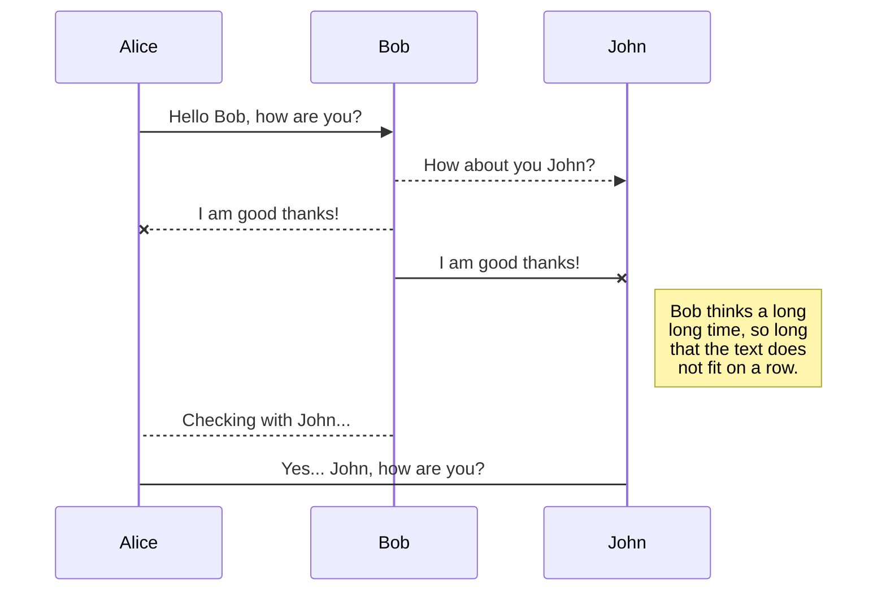
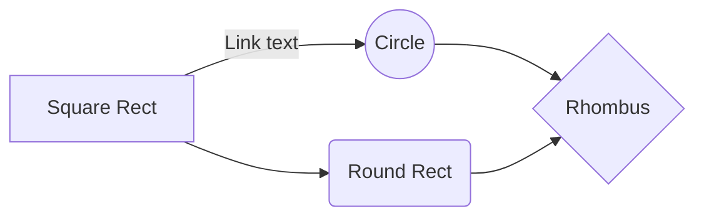

# Markdown extensions

StackEdit extends the standard Markdown syntax by adding extra **Markdown extensions**, providing you with some nice features.

> **ProTip:** You can disable any **Markdown extension** in the **File properties** dialog.


## SmartyPants

SmartyPants converts ASCII punctuation characters into "smart" typographic punctuation HTML entities. For example:

|                |ASCII                          |HTML                         |
|----------------|-------------------------------|-----------------------------|
|Single backticks|`'Isn't this fun?'`            |'Isn't this fun?'            |
|Quotes          |`"Isn't this fun?"`            |"Isn't this fun?"            |
|Dashes          |`-- is en-dash, --- is em-dash`|-- is en-dash, --- is em-dash|


## KaTeX

You can render LaTeX mathematical expressions using [KaTeX](https://khan.github.io/KaTeX/):

The *Gamma function* satisfying $\Gamma(n) = (n-1)!\quad\forall n\in\mathbb N$ is via the Euler integral

$$
\Gamma(z) = \int_0^\infty t^{z-1}e^{-t}dt\,.
$$

> You can find more information about **LaTeX** mathematical expressions [here](http://meta.math.stackexchange.com/questions/5020/mathjax-basic-tutorial-and-quick-reference).


## UML diagrams

You can render UML diagrams using [Mermaid](https://mermaidjs.github.io/). For example, this will produce a sequence diagram:



And this will produce a flow chart:


# A partir de aquí, todo es mío
***  
**Índice**
1. [Prueba para incluir código en C](#id1)
2. [Creación de bloques](#id2)
 > Esto lo debo mejorar, revisaré

~~~
La idea sería esta:
**Índice**   
1. [Primer apartado](#id1)
2. [Segundo apartado](#id2)
## Primer apartado<a name="id1"></a>
Texto del primer apartado
## Segundo apartado<a name="id2"></a>
Texto del segundo apartado
~~~

## Prueba para incluir código en C<a name="id1"></a>

```C
#include <stdio.h>
int main(void){
    printf("Hello world!\n");
    return (0);
}
```
> **Incluyendo** código en C como un quote, se realiza añadiendo tres ` seguido del lenguaje de programación usado, en este caso C, pero podría ser javascript, python, cpp o un largo etc.. 

## Separadores de contenido o lineas
---  
***
___
> Con --- o *** o ___ crearemos una linea separadora como la que se muestra arriba

<div id='id2' />
## Creación de bloques
~~~
A ver que tal funciona
Pues mira, no está mal
~~~
> **Bloque**: con tres ~ crearemos un bloque
  
## Aquí vamos a realizar estilos

_cursiva_ // *cursiva*
__negrita__ // **negrita**
___Negrita + cursiva___ // ***Negrita + cursiva***

> Los básicos serían abriendo y cerrando todo, con simple _ o * estilizaremos como cursivas, con doble __ o ** estilizaremos como negritas y ya con triple ___ o ***, tendremos negrita + cursiva

# Los enlaces
___
## Online
[Google](www.google.es)
> Nombre y el link en si, sería esto, sin el espacio \[enlace en línea](link) 
> Voy a poner un ejemplo que no es mío:
~~~
Me llamo Javier Cristóbal y tengo un blog sobre [productividad mac][blog].
En dicha [web][blog] recopilo artículos sobre todo lo relacionado con automatización, gestión y eficiencia.
[blog]: http://limni.net/blog/
~~~
> No está funcionando correctamente en el visualizador, pero la idea es que Blog es como una variable, de esta forma no tienes que ir incluyendo la URL, es inclusión por referencia

<www.google.es>
> Esto ya nos da un link automático es decir, sin descripción

## Desactivar Markdown

Para desactivar Markdown y poder ver escrito el código, simplemente deberemos poner una \ delante del código que vamos a escribir.

> Este sería el ejemplo de un link con referencia 
> \[Google](www.google.es)
> Si no lo pusieramos quedaría tal que:
> [Google](www.google.es)
